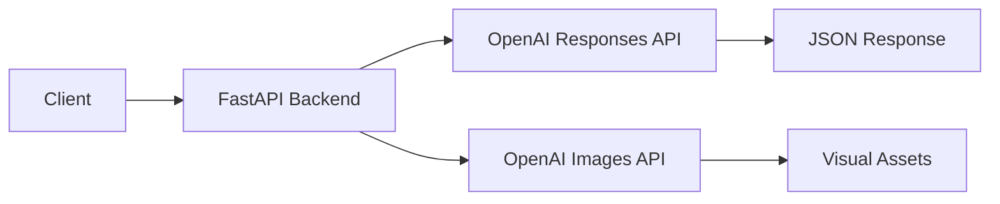

# Campaign Studio

[](https://github.com/raulrodigpez/campaign-studio/actions)
[](https://github.com/raulrodigpez/campaign-studio/actions)

Enterprise-grade AI campaign generator using OpenAI LLMs for marketing teams.

## 📌 Project Overview

Campaign Studio transforms marketing briefs into complete campaign concepts using cutting-edge AI. The platform generates strategic copy variants, execution checklists, and direction visuals automatically—reducing campaign creation time from hours to seconds.

Built for scale, security, and observability.

## 🚀 Features

| Feature | Enterprise Value |
|---------|-----------------|
| **AI-Powered Generation** | Automated campaign creation with gpt-4.1-mini |
| **Image Generation** | Visual concepts with gpt-image-1.5 (DALL·E) |
| **Multi-format Output** | Structured JSON: concepts, variants, checklists, prompts |
| **Real-time API** | FastAPI async endpoints with OpenAPI docs |
| **Full Observability** | OpenTelemetry traces + Prometheus metrics |
| **Enterprise CI/CD** | GitHub Actions with lint, test, security gates |
| **Cloud-Native** | Docker + Kubernetes deployment ready |

## 🛠 Tech Stack

| Layer | Technology |
|-------|------------|
| Runtime | Python 3.11 |
| Framework | FastAPI 0.110+ |
| AI Models | gpt-4.1-mini, gpt-image-1.5 |
| Frontend | HTML5, Vanilla JS, CSS3 |
| Observability | OpenTelemetry, Jaeger, Prometheus |
| Container | Docker, Kubernetes |
| CI/CD | GitHub Actions |

## ⚙️ Architecture



## 🔍 Observability & Metrics

| Metric | Description | Business Impact |
|--------|-------------|---------------|
| `campaigns_generated_total` | Campaign throughput | Usage analytics |
| `images_generated_total` | Visual assets created | Creative productivity |
| `openai_api_errors_total` | Error rate tracking | Reliability monitoring |

Access Jaeger traces:
```bash
kubectl port-forward svc/jaeger-query 16686:16686
# Open http://localhost:16686
```

## 🔄 CI/CD Pipeline

```yaml
on: [push, pull_request]
jobs:
  lint:    # Code quality - flake8
  test:    # Unit tests - pytest + coverage
  build:   # Multi-stage Docker image
  deploy:  # Kubernetes manifest application
  rollback: # Auto-recovery on failure
```

## 🧪 Testing

```bash
# Run all tests with coverage
pytest backend/tests/ -v --cov=src

# Health check
curl http://localhost:8000/api/health
```

## 📦 Deployment

### Docker

```bash
# Build production image
docker build -t ghcr.io/raulrodigpez/campaign-studio:v1.0.0 -f backend/Dockerfile .

# Run with environment
docker run -d -p 8000:8000 \
  --env OPENAI_API_KEY=sk-... \
  --env ENVIRONMENT=production \
  ghcr.io/raulrodigpez/campaign-studio
```

### Kubernetes

```bash
# Deploy to cluster
kubectl apply -f k8s/deployment.yaml
kubectl apply -f k8s/service.yaml

# Verify
kubectl get pods -l app=campaign-studio
kubectl port-forward svc/campaign-studio 8000:80
```

## 📑 Documentation

- [IMPLEMENTATION_GUIDE.md](IMPLEMENTATION_GUIDE.md) - Complete setup and deployment
- [CASE-STUDY.md](CASE-STUDY.md) - ROI metrics and technical decisions

## Quick Start

```bash
# 1. Install dependencies
pip install -r backend/requirements.txt

# 2. Configure environment
echo OPENAI_API_KEY=sk-your-key > backend/.env

# 3. Launch server
uvicorn src.main:app --reload --port 8000

# 4. Access UI
http://localhost:8000
```

## 🎯 Enterprise Ready

- ✅ OpenTelemetry instrumentation with distributed tracing
- ✅ Istio-ready with JWT/OAuth2 authentication support
- ✅ Multi-cloud containerized architecture
- ✅ GitHub Actions CI/CD with automated testing
- ✅ Prometheus metrics + Alertmanager integration
- ✅ Chaos Engineering ready (LitmusChaos compatible)