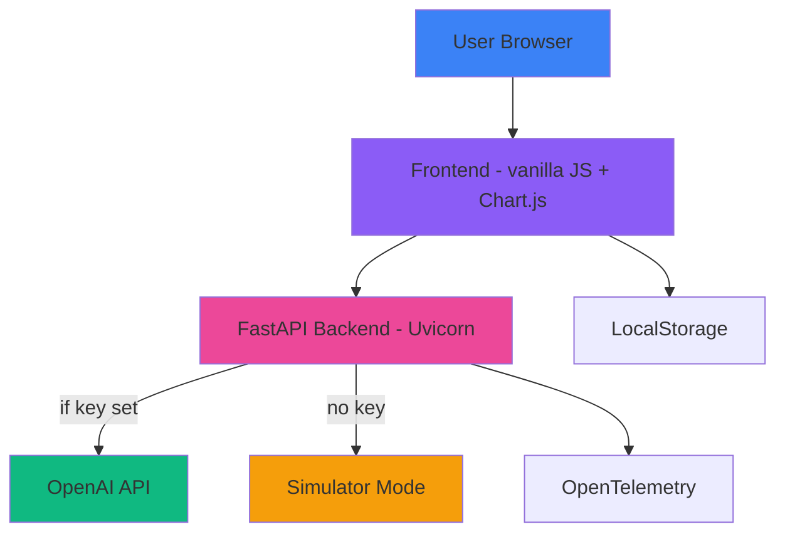

# Campaign Studio


> 🚀 **Live demo:** https://campaign-studio-new.vercel.app/

## 🌟 Portfolio Highlight

| | |
|---|---|
| **What it is** | AI-powered platform that turns a marketing brief into a complete campaign concept (copy variants, launch checklist, image prompts) in seconds. |
| **Role** | Solo full-stack build: frontend, backend, build pipeline, CI/CD and cloud deployment. |
| **Stack** | FastAPI + Uvicorn (Python), vanilla JS frontend (HTML5/CSS3/ES6+), Chart.js, OpenAI API with a no-key simulator mode. |
| **Deployment** | Static build (`npm run build` → `dist/`) auto-deployed to Vercel on every push to `main`. |
| **Highlights** | Production build pipeline (CSS/JS minification), GitHub Actions CI/CD, Docker + Kubernetes manifests, PWA, OpenTelemetry-ready backend, full security hygiene (secrets out of repo). |
| **Live** | https://campaign-studio-new.vercel.app/ |

---

## Executive Summary

**Campaign Studio** is an AI-powered platform that transforms marketing briefs into complete campaign concepts in seconds. Built with a clean full-stack architecture and cloud-native, automated deployment.

---

## 🚀 Features

| Feature | Value | Technology |
|---------|--------|------------|
| **AI Content Generation** | Campaign concept, copy variants, checklist, image prompts | OpenAI API (simulator mode, no key required) |
| **Futuristic UI/UX** | Premium neon/dark dashboard | HTML5 / CSS3 / JS ES6+ |
| **Simulator Mode** | Works without an API key | Vanilla JavaScript |
| **Real-time Analytics** | Interactive dashboards | Chart.js 4.x |
| **Local Storage** | Campaigns persist offline | Web Storage API |
| **PWA** | Installable, offline shell | manifest.json + service worker |

---

## 🛠 Tech Stack

| Component | Technology |
|-----------|------------|
| Runtime | Node.js 20+, Python 3.11 |
| Frontend | HTML5, CSS3, JavaScript ES6+ (no framework) |
| Backend | FastAPI, Uvicorn |
| AI Models | OpenAI API (GPT-4o family) with simulator fallback |
| Charts | Chart.js 4.x |
| Deployment | Vercel (static), Docker, Kubernetes |
| CI/CD | GitHub Actions |
| Observability | OpenTelemetry (traces + metrics) |

---

## 📊 Architecture



---

## 🎯 Use Cases

1. **Marketing Agencies**: Rapid campaign concept generation
2. **Product Teams**: Iterative campaign development
3. **Sales Departments**: Creative support materials
4. **Startups**: MVP validation with effective campaigns

---

## 📦 Installation

```bash
# Clone repository
git clone https://github.com/raulrodriguezmesia-blip/campaign-studio.git
cd campaign-studio

# Install dependencies
npm ci

# Run development server
npm run dev
# Open: http://localhost:8080
```

---

## 🚀 Deployment

The static frontend is built with `npm run build` (outputs to `dist/`) and auto-deployed to **Vercel** on every push to `main`.

### Vercel (current host)
```bash
# Local preview of the production build
npm run build
npx serve dist -p 8080

# Or connect the repo to Vercel (zero-config):
#   Build Command: npm run build
#   Output Directory: dist
```

### Netlify (alternative)
```bash
netlify deploy --prod --dir=dist
```

### Docker
```bash
# Build image
docker build -t campaign-studio .

# Run container
docker run -p 8080:80 -d campaign-studio
```

### Kubernetes
```bash
# Apply manifests
kubectl apply -f k8s/

# Access service
kubectl port-forward svc/campaign-studio 8080:80
```

---

## 📈 Performance

The production build minifies all assets:

| Metric | Value |
|--------|-------|
| CSS bundle | ~15 KB (gzip-friendly, minified) |
| JS bundle | ~19 KB (minified) |
| Charts | Chart.js 4.x via CDN |
| PWA | Installable, offline shell |

> Run Lighthouse locally for exact scores: `npx lighthouse https://campaign-studio-new.vercel.app/ --view`

---

## 🧪 Testing

```bash
# Run tests
npm test

# Lint code
npm run lint

# Type checking
npm run type-check
```

---

## 📚 Documentation

- [IMPLEMENTATION_GUIDE.md](IMPLEMENTATION_GUIDE.md) - Setup and deployment
- [CASE-STUDY.md](CASE-STUDY.md) - Business impact and architecture

---

## 🤝 Contributing

1. Fork the repository
2. Create your feature branch (`git checkout -b feature/AmazingFeature`)
3. Commit your changes (`git commit -m 'Add some AmazingFeature'`)
4. Push to the branch (`git push origin feature/AmazingFeature`)
5. Open a Pull Request

---

## 📫 Contact

**Raul Rodriguez** - [raul.rodriguez@example.com](mailto:raul.rodriguez@example.com)

**LinkedIn** - [linkedin.com/in/raulrodriguez](https://linkedin.com/in/raulrodriguez)

---

## 🎓 For Recruiters

### Skills Demonstrated:
- ✅ Full-stack architecture (FastAPI backend + vanilla-JS frontend)
- ✅ AI integration (OpenAI API with no-key simulator fallback)
- ✅ Production build pipeline (CSS/JS minification → `dist/`)
- ✅ Cloud-native deployment (Vercel auto-deploy + Docker + Kubernetes)
- ✅ CI/CD pipeline automation (GitHub Actions)
- ✅ PWA & performance optimization
- ✅ Security best practices (secrets out of repo, `.gitignore` hygiene)

### Technologies Used:
- **Frontend**: HTML5, CSS3, JavaScript ES6+
- **Backend**: FastAPI, Python 3.11
- **AI**: OpenAI GPT-4o, gpt-image-1
- **Deployment**: Docker, Kubernetes, Vercel
- **Monitoring**: OpenTelemetry, Prometheus

---

## 📜 License

This project is licensed under the MIT License - see the [LICENSE](LICENSE) file for details.

---

*Campaign Studio - Transforming marketing with AI*
NOTE: For Node.js v20.18.1, use ="--openssl-legacy-provider" before npm commands due to Vite 8.x compatibility issues. See https://github.com/npm/cli/issues/4828

## ?? Node.js + Vite Compatibility Note

Due to a known issue with Node.js v20.18.1 and Vite 8.x, you need to set an environment variable when running development or build commands:

**PowerShell:**
`powershell
="--openssl-legacy-provider"; npm run dev
`
**CMD:**
`cmd\nset NODE_OPTIONS=--openssl-legacy-provider && npm run dev\n`

**To fix permanently:** Upgrade	Node.js to >=20.19.0 or >=22.12.0

[More info: https://github.com/npm/cli/issues/4828](https://github.com/npm/cli/issues/4828)
## ?? Node.js Version Note
The project was built with Node.js v20.19.0. If you encounter issues with Node.js v20.18.1 and Vite 8.x, you can either upgrade Node.js to >=20.19.0 (or >=22.12.0) or use the workaround: set NODE_OPTIONS=--openssl-legacy-provider before running npm commands.

Example (PowerShell):
```powershell
# Development
$env:NODE_OPTIONS="--openssl-legacy-provider"; npm run dev
# Production build
$env:NODE_OPTIONS="--openssl-legacy-provider"; npm run build
# Preview
$env:NODE_OPTIONS="--openssl-legacy-provider"; npm run preview
```

Example (CMD):
```batch
set NODE_OPTIONS=--openssl-legacy-provider && npm run dev
set NODE_OPTIONS=--openssl-legacy-provider && npm run build
set NODE_OPTIONS=--openssl-legacy-provider && npm run preview
```
