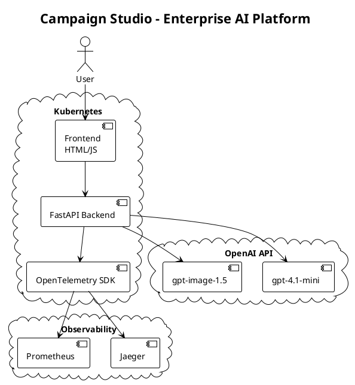
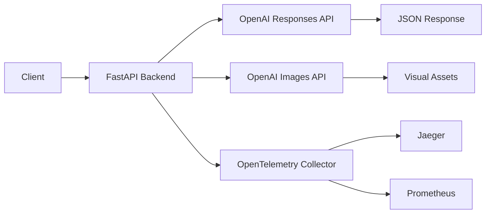

# Campaign Studio


Enterprise AI-powered campaign concept generator using OpenAI LLMs for marketing teams.

## 📌 Project Overview

Campaign Studio transforms marketing briefs into complete campaign concepts using state-of-the-art AI. Built for enterprise with FastAPI backend, OpenTelemetry observability, and production-ready deployment architecture.

Reduces campaign creation time from hours to seconds with intelligent automation.

## 🚀 Features

| Feature | Enterprise Value |
|---------|-----------------|
| **AI Content Generation** | OpenAI gpt-4.1-mini for concepts |
| **Visual Campaign Direction** | gpt-image-1.5 for DALL·E assets |
| **Multi-format Output** | JSON: concepts, variants, checklists, prompts |
| **FastAPI Backend** | Async endpoints with automatic OpenAPI docs |
| **OpenTelemetry Stack** | Distributed tracing, Prometheus metrics |
| **Enterprise CI/CD** | Automated testing and deployment |
| **Containerized** | Docker + Kubernetes production ready |

## 🛠 Tech Stack

| Component | Technology |
|-----------|------------|
| Runtime | Python 3.11 |
| Framework | FastAPI 0.110+ |
| AI Models | gpt-4.1-mini, gpt-image-1.5 |
| Frontend | HTML5, Vanilla JS, CSS3 |
| Observability | OpenTelemetry, Jaeger, Prometheus |
| Container | Docker, Kubernetes |
| CI/CD | GitHub Actions |

## ⚙️ Architecture

### PlantUML



### ASCII Diagram



```
+-----------+
|  Frontend |
| HTML/JS   |
+-----+-----+
      |
      v
+-------+-------+
|   FastAPI     |
|   Backend     |
+-------+-------+
      |
      v
+-------+-------+
|   OpenAI API  |
+---------------+

Observability: OpenTelemetry → Jaeger
CI/CD: GitHub Actions
Deployment: Docker → Kubernetes
```

## 🔍 Observability & Metrics

| Metric | Business Impact |
|--------|---------------|
| `campaigns_generated_total` | Campaign throughput analytics |
| `images_generated_total` | Creative productivity tracking |
| `openai_api_errors_total` | API reliability monitoring |

```bash
# View traces
kubectl port-forward svc/jaeger-query 16686:16686
```

## 🔄 CI/CD Pipeline

```yaml
on: [push, pull_request]
jobs:
  lint:    # Code quality - flake8
  test:    # Unit tests - pytest + coverage
  build:   # Multi-stage Docker image
  deploy:  # Kubernetes rolling update
  rollback: # Auto-recovery on failure
```

## 🧪 Testing

```bash
pytest backend/tests/ -v --cov=src
```

## 📦 Deployment

### Docker

```bash
docker build -t ghcr.io/user/campaign-studio:v1.0.0 -f backend/Dockerfile .
docker run -d -p 8000:8000 --env OPENAI_API_KEY=sk-... campaign-studio
```

### Kubernetes

```bash
kubectl apply -f k8s/deployment.yaml
kubectl apply -f k8s/service.yaml
```

### Terraform

```bash
terraform workspace select prod
terraform init
terraform apply -var="environment=prod"
```

## 📑 Documentation

- [IMPLEMENTATION_GUIDE.md](IMPLEMENTATION_GUIDE.md) - Setup and deployment
- [CASE-STUDY.md](CASE-STUDY.md) - Business impact and architecture

## Quick Start

```bash
pip install -r backend/requirements.txt
echo "OPENAI_API_KEY=sk-..." > backend/.env
uvicorn src.main:app --reload --port 8000
```