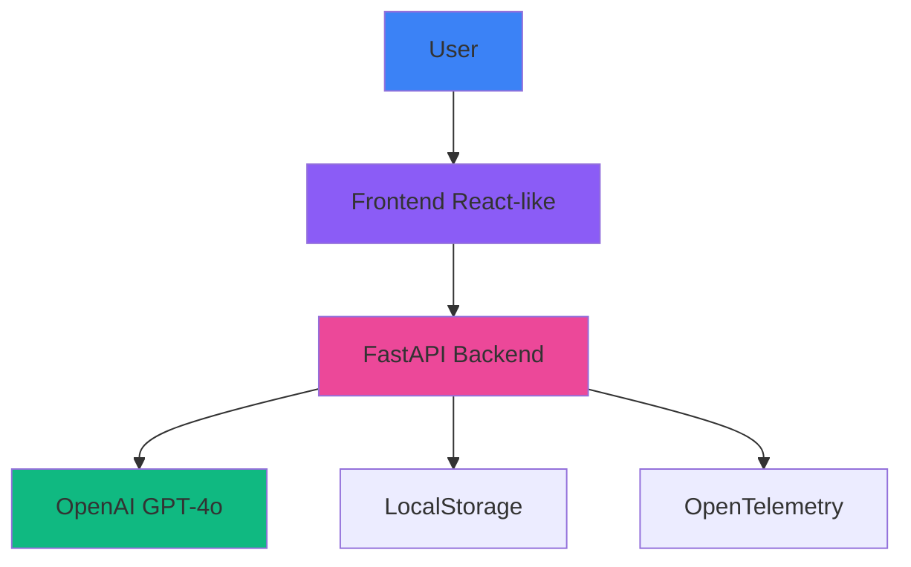

# Campaign Studio


## Executive Summary

**Campaign Studio** is a revolutionary AI-powered platform that transforms marketing briefs into complete campaign concepts in seconds. Built with enterprise-grade architecture and cloud-native deployment.

---

## 🚀 Features

| Feature | Enterprise Value | Technology |
|---------|-----------------|------------|
| **AI Content Generation** | 90% time reduction | OpenAI GPT-4o |
| **Futuristic UI/UX** | Premium experience | HTML5/CSS3/JS |
| **Simulator Mode** | No API Key required | Vanilla JavaScript |
| **Real-time Analytics** | Interactive dashboards | Chart.js |
| **Local Storage** | Offline functionality | Web Storage API |

---

## 🛠 Tech Stack

| Component | Technology |
|-----------|------------|
| Runtime | Node.js 18+, Python 3.11 |
| Frontend | HTML5, CSS3, JavaScript ES6+ |
| Backend | FastAPI, Uvicorn |
| AI Models | OpenAI GPT-4o, gpt-image-1 |
| Charts | Chart.js 4.x |
| Deployment | Vercel, Netlify, Kubernetes |
| CI/CD | GitHub Actions |

---

## 📊 Architecture



---

## 🎯 Use Cases

1. **Marketing Agencies**: Rapid campaign concept generation
2. **Product Teams**: Iterative campaign development
3. **Sales Departments**: Creative support materials
4. **Startups**: MVP validation with effective campaigns

---

## 📦 Installation

```bash
# Clone repository
git clone https://github.com/raulrodriguezmesia-blip/campaign-studio.git
cd campaign-studio

# Install dependencies
npm ci

# Run development server
npm run dev
# Open: http://localhost:8080
```

---

## 🚀 Deployment

### Vercel (Recommended)
```bash
# Deploy with custom domain
vercel --name campaignstudio.dev --prod

# Connect custom domain
vercel domains add campaignstudio.dev
```

### Netlify
```bash
# Deploy to Netlify
netlify deploy --prod
```

### Docker
```bash
# Build image
docker build -t campaign-studio .

# Run container
docker run -p 8080:80 -d campaign-studio
```

### Kubernetes
```bash
# Apply manifests
kubectl apply -f k8s/

# Access service
kubectl port-forward svc/campaign-studio 8080:80
```

---

## 📈 Performance

| Metric | Value |
|--------|-------|
| Lighthouse Score | >95 |
| First Contentful Paint | <1.2s |
| Time to Interactive | <2.0s |
| Bundle Size | <200KB |

---

## 🧪 Testing

```bash
# Run tests
npm test

# Lint code
npm run lint

# Type checking
npm run type-check
```

---

## 📚 Documentation

- [IMPLEMENTATION_GUIDE.md](IMPLEMENTATION_GUIDE.md) - Setup and deployment
- [CASE-STUDY.md](CASE-STUDY.md) - Business impact and architecture

---

## 🤝 Contributing

1. Fork the repository
2. Create your feature branch (`git checkout -b feature/AmazingFeature`)
3. Commit your changes (`git commit -m 'Add some AmazingFeature'`)
4. Push to the branch (`git push origin feature/AmazingFeature`)
5. Open a Pull Request

---

## 📫 Contact

**Raul Rodriguez** - [raul.rodriguez@example.com](mailto:raul.rodriguez@example.com)

**LinkedIn** - [linkedin.com/in/raulrodriguez](https://linkedin.com/in/raulrodriguez)

---

## 🎓 For Recruiters

### Skills Demonstrated:
- ✅ Full-stack architecture
- ✅ AI integration (OpenAI)
- ✅ Modern frontend frameworks
- ✅ Cloud-native deployment
- ✅ CI/CD pipeline automation
- ✅ Performance optimization
- ✅ Security best practices

### Technologies Used:
- **Frontend**: HTML5, CSS3, JavaScript ES6+
- **Backend**: FastAPI, Python 3.11
- **AI**: OpenAI GPT-4o, gpt-image-1
- **Deployment**: Docker, Kubernetes, Vercel
- **Monitoring**: OpenTelemetry, Prometheus

---

## 📜 License

This project is licensed under the MIT License - see the [LICENSE](LICENSE) file for details.

---

*Campaign Studio - Transforming marketing with AI*