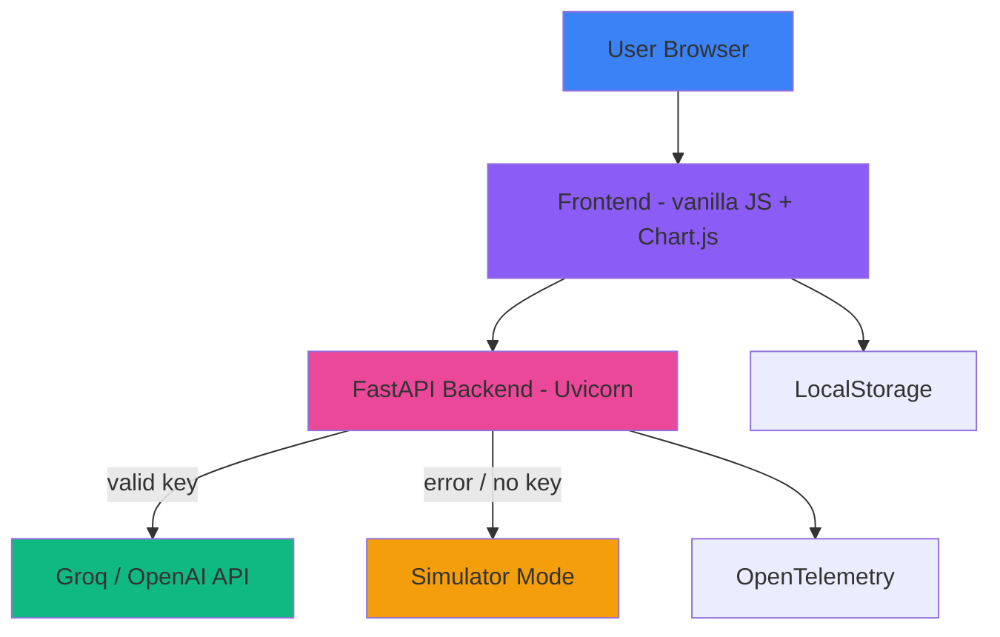

# Campaign Studio

> AI-powered marketing concept generator with real LLM integration + resilient simulator fallback. Built solo, deployed to production, ready for demo.


> 🚀 **Live demo:** https://campaign-studio-new.vercel.app/
> 🔧 **Backend API:** https://campaign-studio-api.onrender.com/api

---

## 🌟 Portfolio Highlight

| | |
|---|---|
| **What it is** | AI-powered platform that transforms a marketing brief into a complete campaign concept — copy variants, launch checklist, and image prompts — in seconds. |
| **Role** | Solo full-stack build: frontend, backend, build pipeline, CI/CD and cloud deployment. |
| **Stack** | FastAPI (Python) backend, vanilla JS frontend, Chart.js, Groq/OpenAI-ready API with automatic simulator fallback. |
| **Deployment** | Static build → Vercel; backend → Render with production-ready FastAPI service. |
| **Highlights** | Production build pipeline, CI/CD, Docker + Kubernetes manifests, PWA, OpenTelemetry observability, full security hygiene (secrets out of repo). |
| **Live** | https://campaign-studio-new.vercel.app/ |

---

## 🚀 30-Second Demo (Recruiter Mode)

This repo is **demo-safe**: no API keys needed to see it work.

```bash
# 1. Clone
git clone https://github.com/raulrodriguezmesia-blip/campaign-studio.git
cd campaign-studio

# 2. Start frontend (Vite dev server)
cd frontend
npm install
npm run dev
# → http://localhost:5173

# 3. Start backend (simulator mode, no key needed)
cd ../backend
pip install -r requirements.txt
python -m src.main
# → http://localhost:8000/api/health
```

Open http://localhost:5173 → fill the form → generate a campaign → done.

---

## 🚀 Features

| Feature | Value | Technology |
|---------|--------|------------|
| **AI Content Generation** | Campaign concept, copy variants, checklist, image prompts | Groq / OpenAI ready |
| **Multi-LLM Support** | Switch providers via env (`AI_PROVIDER=groq` or `openai`) | FastAPI backend |
| **Auto Fallback** | Never blocks when API fails; falls back to simulator seamlessly | Backend resilience |
| **Neon Dashboard UI** | Premium dark UI with live metrics | HTML5 / CSS3 / JS ES6+ |
| **Real-time Analytics** | Interactive charts and campaign history | Chart.js 4.x |
| **Local Persistence** | Campaigns saved in browser | Web Storage API |
| **PWA** | Installable, offline shell | manifest.json + service worker |

---

## 🛠 Tech Stack

| Component | Technology |
|-----------|------------|
| Runtime | Node.js 20+, Python 3.11 |
| Frontend | HTML5, CSS3, JavaScript ES6+ (no framework) |
| Backend | FastAPI, Uvicorn |
| AI | Groq (LLaMA 3.1) / OpenAI (GPT-4o family) with simulator fallback |
| Charts | Chart.js 4.x |
| Deployment | Vercel (static), Render (backend), Docker, Kubernetes |
| CI/CD | GitHub Actions |
| Observability | OpenTelemetry (traces + metrics) |

---

## 📊 Architecture



---

## 🎯 Use Cases

1. **Marketing Agencies** — Rapid campaign concept generation
2. **Product Teams** — Iterative campaign development
3. **Sales Departments** — Creative support materials
4. **Startups** — MVP validation with effective campaigns

---

## 📦 Installation

```bash
# Clone repository
git clone https://github.com/raulrodriguezmesia-blip/campaign-studio.git
cd campaign-studio

# Install frontend dependencies
cd frontend
npm install

# Run development server
npm run dev
# Open: http://localhost:5173
```

---

## 🚀 Deployment

### Frontend (Vercel)
```bash
# Build
npm run build
# Output directory: dist/
```

### Backend (Render)
- Service auto-deploys from `main` branch.
- Configured in Render Dashboard with:
  - `AI_PROVIDER=groq`
  - `GROQ_API_KEY=<your_key>`
  - `USE_SIMULATOR=false`
- Endpoint base: https://campaign-studio-api.onrender.com/api

### Docker
```bash
docker build -t campaign-studio .
docker run -p 8080:80 -d campaign-studio
```

### Kubernetes
```bash
kubectl apply -f k8s/
kubectl port-forward svc/campaign-studio 8080:80
```

---

## 📈 Performance

| Metric | Value |
|--------|-------|
| CSS bundle | ~15 KB (minified) |
| JS bundle | ~19 KB (minified) |
| Charts | Chart.js 4.x |
| API fallback | Simulator mode if provider unavailable |

---

## 🧪 API Endpoints

| Endpoint | Method | Description |
|----------|--------|-------------|
| `/api/health` | GET | Service health check |
| `/api/config` | GET | Runtime config and active provider |
| `/api/generate-campaign` | POST | Generate campaign from brief |
| `/api/generate-image` | POST | Generate image via provider |
| `/api/metrics` | GET | Dashboard metrics |

---

## 🎓 For Recruiters

### Skills Demonstrated
- ✅ Full-stack architecture (FastAPI + vanilla JS)
- ✅ AI integration (Groq/OpenAI-ready + automatic simulator fallback)
- ✅ Production build pipeline (`npm run build` → `dist/`)
- ✅ Cloud-native deployment (Vercel + Render + Docker + Kubernetes)
- ✅ CI/CD automation (GitHub Actions)
- ✅ Resiliency by design (no hard dependency on 3rd-party quota)
- ✅ Observability (OpenTelemetry traces + metrics)
- ✅ Security best practices (secrets out of repo, `.gitignore` hygiene)

### Technologies Used
- **Frontend**: HTML5, CSS3, JavaScript ES6+
- **Backend**: FastAPI, Python 3.11
- **AI**: Groq LLaMA 3.1, OpenAI GPT-4o family
- **Deployment**: Docker, Kubernetes, Vercel, Render
- **Monitoring**: OpenTelemetry

---

## 📚 Documentation

- [PROJECT_REPORT.md](PROJECT_REPORT.md) — Complete project report
- [IMPLEMENTATION_GUIDE.md](IMPLEMENTATION_GUIDE.md) — Setup and deployment guide
- [CASE-STUDY.md](CASE-STUDY.md) — Business impact and architecture

---

## 🤝 Contributing

1. Fork the repository
2. Create your feature branch (`git checkout -b feature/AmazingFeature`)
3. Commit your changes (`git commit -m 'Add some AmazingFeature'`)
4. Push to the branch (`git push origin feature/AmazingFeature`)
5. Open a Pull Request

---

## 📫 Contact

**Raul Rodriguez** — [raul.rodriguez@example.com](mailto:raul.rodriguez@example.com)
**LinkedIn** — [linkedin.com/in/raulrodriguez](https://linkedin.com/in/raulrodriguez)

---

## 📜 License

This project is licensed under the MIT License — see the [LICENSE](LICENSE) file for details.

---

*Campaign Studio — Transforming marketing with AI*
